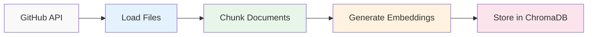

The data ingestion pipeline is the foundation of RepoRAGX. It runs once per repository to fetch code from GitHub, process it into chunks, generate embeddings, and store them in a vector database for fast semantic search.

## Pipeline overview

The ingestion process follows five sequential steps:



Each step transforms the data into a format optimized for semantic search.

## Step 1: Load files from GitHub

**Component**: `GitHubCodeBaseLoader` (`src/rag/github_codebase_loader.py`)

The loader fetches repository contents using GitHub's API with intelligent filtering to exclude non-source files:

```python
loader = GitHubCodeBaseLoader(
    repo="owner/repo",
    branch="main",
    access_token=github_token
)
docs = loader.load()
```

### Filtering strategy

The loader implements two-level filtering:

<Accordion title="Excluded file extensions">
  Binary and non-text files that don't contribute to code understanding:
  
  - **Images**: `.png`, `.jpg`, `.svg`, `.ico`, `.webp`
  - **Archives**: `.zip`, `.tar`, `.gz`, `.rar`, `.7z`
  - **Binaries**: `.exe`, `.dll`, `.so`, `.pyc`, `.class`
  - **Media**: `.mp3`, `.mp4`, `.wav`, `.avi`
  - **Documents**: `.pdf`, `.doc`, `.xls`, `.ppt`
  - **Minified**: `.min.js`, `.min.css`
  - **Databases**: `.db`, `.sqlite`
  
  Defined in `github_codebase_loader.py:3-14`
</Accordion>

<Accordion title="Excluded directories">
  Common folders containing dependencies and generated files:
  
  - `node_modules/` - JavaScript dependencies
  - `.git/` - Version control data
  - `dist/`, `build/` - Build artifacts
  - `__pycache__/` - Python bytecode
  - `venv/`, `.venv/` - Python virtual environments
  
  Defined in `github_codebase_loader.py:16-24`
</Accordion>

### Lazy loading

Files are loaded one-by-one using lazy loading to handle large repositories efficiently:

```python
for doc in self.loader.lazy_load():
    try:
        docs.append(doc)
    except Exception:
        print(f"Skipping file: {doc.metadata.get('path','unknown')}")
```

This approach prevents memory issues when processing repositories with thousands of files.

<Info>
  Each loaded document includes metadata like `path`, `source`, and `repo` for traceability during retrieval.
</Info>

## Step 2: Chunk documents

**Component**: `TextSplitter` (`src/rag/text_splitter.py`)

Code files are split into smaller chunks to fit within embedding model constraints and improve retrieval precision:

```python
chunks = TextSplitter(
    documents=docs,
    chunk_size=1000,
    chunk_overlap=200
).split_documents_into_chunks()
```

### Language-aware splitting

The splitter recognizes 20+ programming languages and uses syntax-aware boundaries:

<CodeGroup>
```python Python example
# Splits on class/function definitions
class MyClass:     # ← Natural boundary
    def method():  # ← Another boundary
        pass
```

```javascript JavaScript example
// Splits on function declarations
function myFunc() {  // ← Natural boundary
  const x = 1;
}
```
</CodeGroup>

Supported languages include:
- **Web**: JavaScript, TypeScript, PHP, HTML
- **Systems**: C, C++, Rust, Go, Swift
- **JVM**: Java, Kotlin, Scala
- **Scripting**: Python, Ruby, Lua, Perl, R
- **Functional**: Haskell, Elixir
- **Others**: Solidity, C#, PowerShell, Markdown

Mapping defined in `text_splitter.py:3-50`

### Chunking parameters

<Steps>
  <Step title="Chunk size: 1000 characters">
    Balances context preservation with embedding model efficiency. Large enough to capture function implementations, small enough for precise matching.
  </Step>
  
  <Step title="Chunk overlap: 200 characters">
    Creates 20% overlap between consecutive chunks to prevent information loss at boundaries. Critical for functions that span chunk edges.
  </Step>
</Steps>

### Fallback splitter

For unrecognized file types, a generic recursive splitter is used:

```python
RecursiveCharacterTextSplitter(
    chunk_size=1000,
    chunk_overlap=200,
    separators=["\n\n", "\n", " ", ""]
)
```

This tries splitting on double newlines first, then single newlines, then spaces.

## Step 3: Generate embeddings

**Component**: `EmbeddingManager` (`src/rag/embedding_manager.py`)

Text chunks are converted to numerical vectors using the Sentence Transformers library:

```python
embedding_manager = EmbeddingManager(model_name="all-MiniLM-L6-v2")
texts = [doc.page_content for doc in chunks]
embeddings = embedding_manager.generate_embeddings(texts)
```

### Model: all-MiniLM-L6-v2

This model is specifically chosen for code understanding:

<Note>
  **Dimensions**: 384-dimensional vectors
  
  **Speed**: Encodes ~10,000 tokens/second on CPU
  
  **Quality**: Trained on 1B+ sentence pairs for semantic similarity
  
  **Size**: 80MB model weights—small enough for local execution
</Note>

The model is loaded once and reused for all chunks:

```python
self.model = SentenceTransformer(self.model_name)
embeddings = self.model.encode(texts, show_progress_bar=True)
```

### Output format

Generates a numpy array of shape `(n_chunks, 384)`:

```python
# Example for 1,000 chunks:
embeddings.shape  # (1000, 384)
```

Each row is a 384-dimensional vector representing the semantic meaning of one chunk.

<Tip>
  The same model must be used for both document embedding and query embedding to ensure vectors exist in the same semantic space.
</Tip>

## Step 4: Store in ChromaDB

**Component**: `VectorStore` (`src/rag/vector_store.py`)

Embeddings are persisted in ChromaDB for efficient similarity search:

```python
vector_store = VectorStore(
    collection_name=repo.replace("/", "_"),
    persist_directory=Path.home() / ".RepoRAGX" / "vector_store"
)
vector_store.add_documents(chunks, embeddings)
```

### ChromaDB configuration

The vector store is initialized with specific settings:

```python
self.collection = self.client.get_or_create_collection(
    name=collection_name,
    metadata={
        "hnsw:space": "cosine",           # Cosine similarity metric
        "repo": collection_name,           # Repository identifier
        "type": "github_codebase",         # Collection type
        "embedding_model": "all-MiniLM-L6-v2"  # Model reference
    }
)
```

<Info>
  **Similarity metric**: Cosine similarity measures the angle between vectors, making it ideal for semantic similarity regardless of text length.
</Info>

### Document storage

Each chunk is stored with:

1. **Unique ID**: Generated UUID for tracking (`doc_{uuid}_{index}`)
2. **Embedding**: 384-dimensional vector
3. **Metadata**: Original file path, document index, content length
4. **Content**: Full text of the chunk

```python
self.collection.add(
    ids=ids,
    embeddings=embeddings_list,
    metadatas=metadatas,
    documents=documents_text
)
```

Implementation: `vector_store.py:42-81`

### Persistence strategy

<Accordion title="Local storage location">
  Vectors are stored at `~/.RepoRAGX/vector_store/` with the following structure:
  
  ```
  ~/.RepoRAGX/
  └── vector_store/
      ├── chroma.sqlite3        # Metadata database
      └── {collection_id}/       # Per-collection data
          ├── data_level0.bin   # HNSW index
          └── header.bin        # Index metadata
  ```
  
  This allows instant reuse without re-embedding when querying the same repository.
</Accordion>

<Accordion title="Collection naming">
  Collections are named after repositories with slashes replaced:
  
  - `facebook/react` → `facebook_react`
  - `microsoft/vscode` → `microsoft_vscode`
  
  Each repository gets its own isolated collection.
</Accordion>

### HNSW indexing

ChromaDB uses Hierarchical Navigable Small World (HNSW) graphs for fast approximate nearest neighbor search:

- **Search time**: O(log n) instead of O(n) for brute force
- **Accuracy**: >95% recall at top-10 results
- **Trade-off**: Small amount of disk space for dramatic speed improvement

## Complete ingestion flow

Here's the complete pipeline as implemented in `src/main.py:37-44`:

```python
# Step 1: Load from GitHub
docs = GitHubCodeBaseLoader(
    repo=repo,
    branch=branch,
    access_token=github_token
).load()

# Step 2: Chunk documents
chunks = TextSplitter(docs).split_documents_into_chunks()

# Step 3: Generate embeddings
embedding_manager = EmbeddingManager()
texts = [doc.page_content for doc in chunks]
embeddings = embedding_manager.generate_embeddings(texts)

# Step 4: Store in vector database
vector_store = VectorStore(
    collection_name=repo.replace("/", "_"),
    persist_directory=persist_directory
)
vector_store.add_documents(chunks, embeddings)
```

## Performance considerations

<CardGroup cols={2}>
  <Card title="Embedding speed" icon="bolt">
    **~10,000 tokens/second** on modern CPUs
    
    A 10,000-line repository (≈500k tokens) embeds in ~50 seconds
  </Card>
  
  <Card title="Storage efficiency" icon="hard-drive">
    **384 dimensions × 4 bytes** = 1.5KB per chunk
    
    1,000 chunks = ~1.5MB storage (plus index overhead)
  </Card>
  
  <Card title="Memory usage" icon="memory">
    **Model**: 80MB (loaded once)
    
    **Peak**: ~500MB for large repos during embedding generation
  </Card>
  
  <Card title="Network transfer" icon="cloud">
    **Depends on repo size**
    
    Lazy loading prevents memory spikes from large repositories
  </Card>
</CardGroup>

## Error handling

The pipeline gracefully handles common issues:

<Steps>
  <Step title="File access errors">
    Skipped files are logged but don't halt the pipeline:
    ```python
    except Exception:
        print(f"Skipping file: {doc.metadata.get('path','unknown')}")
    ```
  </Step>
  
  <Step title="Existing collections">
    Previous collections are deleted before re-indexing:
    ```python
    self.client.delete_collection(name=self.collection_name)
    ```
  </Step>
  
  <Step title="Model loading failures">
    Raises early with clear error messages:
    ```python
    except Exception as e:
        print(f"Error loading model {self.model_name}: {e}")
        raise
    ```
  </Step>
</Steps>

## Next steps

<Card title="RAG retrieval" icon="search" href="/concepts/rag-retrieval">
  Learn how queries are processed and answers are generated using the ingested data
</Card>