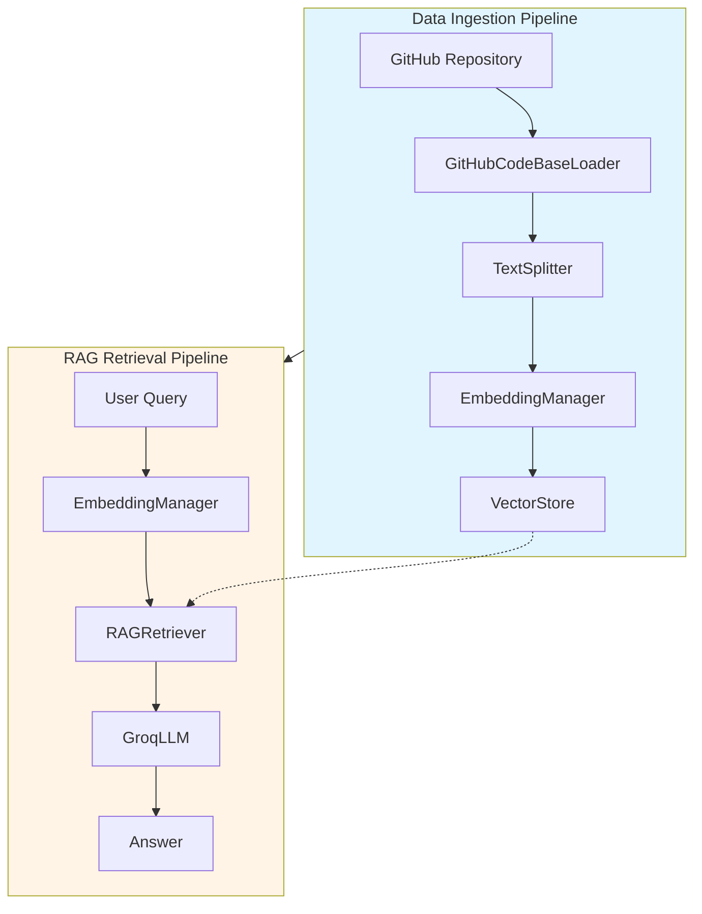

RepoRAGX is built on a two-pipeline architecture that enables intelligent question-answering over GitHub repositories. The system transforms code into searchable knowledge and retrieves relevant context for LLM-powered responses.

## Architecture overview

The system consists of two distinct pipelines that work together:

<Steps>
  <Step title="Data ingestion pipeline">
    Fetches code from GitHub, processes it into chunks, generates embeddings, and stores them in a vector database for efficient retrieval.
  </Step>
  
  <Step title="RAG retrieval pipeline">
    Takes user queries, converts them to embeddings, finds similar code chunks, and generates contextual answers using an LLM.
  </Step>
</Steps>

## Core components

RepoRAGX orchestrates several specialized components, each handling a specific responsibility:

### GitHubCodeBaseLoader

**Location**: `src/rag/github_codebase_loader.py`

Responsible for fetching repository contents from GitHub with intelligent filtering:

```python
loader = GitHubCodeBaseLoader(
    repo="owner/repo",
    branch="main",
    access_token=github_token
)
docs = loader.load()
```

The loader excludes binary files, build artifacts, and dependency folders (like `node_modules/` and `.git/`) to focus on actual source code.

### TextSplitter

**Location**: `src/rag/text_splitter.py`

Breaks documents into manageable chunks while preserving code structure:

```python
chunks = TextSplitter(docs).split_documents_into_chunks()
```

Supports language-aware splitting for 20+ programming languages including Python, JavaScript, TypeScript, Java, Rust, and Go. Uses a default chunk size of 1000 characters with 200-character overlap to maintain context.

### EmbeddingManager

**Location**: `src/rag/embedding_manager.py`

Generates vector embeddings using Sentence Transformers:

```python
embedding_manager = EmbeddingManager()  # Uses all-MiniLM-L6-v2
embeddings = embedding_manager.generate_embeddings(texts)
```

The `all-MiniLM-L6-v2` model produces 384-dimensional embeddings optimized for semantic similarity.

### VectorStore

**Location**: `src/rag/vector_store.py`

Manages persistent storage using ChromaDB with cosine similarity:

```python
vector_store = VectorStore(
    collection_name=repo.replace("/", "_"),
    persist_directory=Path.home() / ".RepoRAGX" / "vector_store"
)
vector_store.add_documents(chunks, embeddings)
```

Stores embeddings locally in `~/.RepoRAGX/vector_store` for fast retrieval across sessions.

### RAGRetriever

**Location**: `src/rag/rag_retriever.py`

Performs semantic search to find relevant code chunks:

```python
rag_retriever = RAGRetriever(
    vector_store=vector_store,
    embedding_manager=embedding_manager
)
results = rag_retriever.retrieve(query, top_k=5)
```

Returns ranked results with similarity scores based on cosine distance.

### GroqLLM

**Location**: `src/rag/groq_llm.py`

Generates natural language answers using Groq's LLM API:

```python
llm = GroqLLM(model_name="llama-3.3-70b-versatile")
answer = llm.rag(query=query, retriever=rag_retriever)
```

Combines retrieved context with user queries to produce accurate, contextual responses.

## The two-pipeline flow

<Accordion title="Pipeline 1: Data ingestion (one-time setup)">
  This pipeline runs once per repository to build the searchable knowledge base:
  
  1. **Load**: Fetch files from GitHub repository
  2. **Filter**: Exclude binary files and build artifacts
  3. **Chunk**: Split files into overlapping segments
  4. **Embed**: Convert text to 384-dimensional vectors
  5. **Store**: Persist embeddings in ChromaDB
  
  Implemented in `src/main.py:37-44`
</Accordion>

<Accordion title="Pipeline 2: RAG retrieval (per query)">
  This pipeline runs for each user question:
  
  1. **Query**: User asks a question about the codebase
  2. **Embed**: Convert query to same vector space
  3. **Search**: Find top-k similar chunks using cosine similarity
  4. **Retrieve**: Fetch matching code snippets with metadata
  5. **Generate**: LLM synthesizes answer from context
  
  Implemented in `src/main.py:49-54` and `src/rag/groq_llm.py:28-56`
</Accordion>

## Data flow diagram



## Key design decisions

<Note>
  **Why ChromaDB?** Provides efficient cosine similarity search with persistent storage, allowing the vector database to be reused across sessions without re-embedding.
</Note>

<Note>
  **Why all-MiniLM-L6-v2?** Balances speed and quality—fast enough for real-time embedding generation while maintaining strong semantic understanding for code.
</Note>

<Note>
  **Why chunk overlap?** The 200-character overlap (20% of chunk size) ensures important context isn't lost at chunk boundaries, improving retrieval accuracy.
</Note>

## Main execution flow

The entry point at `src/main.py` orchestrates both pipelines:

```python
# Pipeline 1: Ingestion
docs = GitHubCodeBaseLoader(repo=repo, branch=branch, access_token=token).load()
chunks = TextSplitter(docs).split_documents_into_chunks()
embeddings = embedding_manager.generate_embeddings([doc.page_content for doc in chunks])
vector_store.add_documents(chunks, embeddings)

# Pipeline 2: Retrieval (interactive loop)
while True:
    query = input("Ask anything: ")
    answer = llm.rag(query=query, retriever=rag_retriever)
    print(answer)
```

<Tip>
  Once ingestion completes, the vector store persists at `~/.RepoRAGX/vector_store/`, enabling fast startup times for subsequent sessions with the same repository.
</Tip>

## Next steps

<CardGroup cols={2}>
  <Card title="Data ingestion" icon="database" href="/concepts/data-ingestion">
    Deep dive into the ingestion pipeline
  </Card>
  <Card title="RAG retrieval" icon="search" href="/concepts/rag-retrieval">
    Learn how query processing works
  </Card>
</CardGroup>