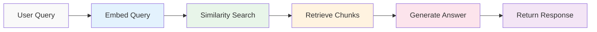

The RAG (Retrieval-Augmented Generation) retrieval pipeline powers RepoRAGX's question-answering capabilities. It converts user queries into embeddings, searches for similar code chunks, and uses an LLM to generate accurate, contextual answers.

## Retrieval pipeline overview

The retrieval process follows five steps for each query:



This happens in real-time for every question asked.

## Step 1: Embed the query

**Component**: `EmbeddingManager` (`src/rag/embedding_manager.py`)

The user's natural language query is converted to the same 384-dimensional vector space as the code chunks:

```python
query = "How does authentication work?"
query_embedding = embedding_manager.generate_embeddings([query])[0]
```

### Same model requirement

<Note>
  **Critical**: The query must be embedded using the exact same model (`all-MiniLM-L6-v2`) that was used during data ingestion. Different models produce incompatible vector spaces.
</Note>

The embedding process is identical to document embedding:

1. Tokenize the query text
2. Pass through the neural network
3. Extract the 384-dimensional sentence embedding
4. Normalize the vector for cosine similarity

### Output format

Produces a single numpy array of shape `(384,)`:

```python
query_embedding.shape  # (384,)
```

This vector encodes the semantic meaning of the query.

## Step 2: Similarity search

**Component**: `RAGRetriever` (`src/rag/rag_retriever.py`)

The query embedding is compared against all stored document embeddings using cosine similarity:

```python
results = vector_store.collection.query(
    query_embeddings=[query_embedding.tolist()],
    n_results=top_k
)
```

### Cosine similarity explained

Cosine similarity measures the angle between two vectors, ranging from -1 to 1:

<Steps>
  <Step title="Score = 1 (0°)">
    Vectors point in exactly the same direction—perfect semantic match
  </Step>
  
  <Step title="Score = 0 (90°)">
    Vectors are orthogonal—unrelated concepts
  </Step>
  
  <Step title="Score = -1 (180°)">
    Vectors point in opposite directions—contradictory meanings
  </Step>
</Steps>

Formula:

```
cosine_similarity = (A · B) / (||A|| × ||B||)
```

Where `A` is the query vector and `B` is a document vector.

### ChromaDB distance to similarity

ChromaDB returns cosine **distance** (not similarity), so it's converted:

```python
similarity_score = 1 - distance
```

Implemented in `rag_retriever.py:27`

<Info>
  **Distance = 0.2** → **Similarity = 0.8** (80% match)
  
  **Distance = 0.5** → **Similarity = 0.5** (50% match)
</Info>

### Top-K retrieval

By default, the top 5 most similar chunks are retrieved:

```python
retriever.retrieve(query, top_k=5)
```

This balances context quality with token limits. More results provide broader context but may dilute relevance.

## Step 3: Filter by threshold

**Component**: `RAGRetriever` (`src/rag/rag_retriever.py:29`)

Retrieved results can be filtered by minimum similarity score:

```python
if similarity_score >= score_threshold:
    retrieved_docs.append({
        'id': doc_id,
        'content': document,
        'metadata': metadata,
        'similarity_score': similarity_score,
        'distance': distance,
        'rank': i + 1
    })
```

### Default threshold: 0.0

The default threshold of `0.0` accepts all results, relying on top-k ranking instead:

```python
retriever.retrieve(query, top_k=5, score_threshold=0.0)
```

<Tip>
  For stricter filtering, increase the threshold:
  
  - **0.5**: Moderate similarity required
  - **0.7**: High similarity required
  - **0.9**: Near-identical matches only
</Tip>

## Step 4: Retrieve document chunks

**Component**: `RAGRetriever` (`src/rag/rag_retriever.py:1-48`)

Each retrieved result contains:

<Accordion title="Document ID">
  Unique identifier in format `doc_{uuid}_{index}`:
  
  ```python
  'id': 'doc_a3f2b1c0_42'
  ```
</Accordion>

<Accordion title="Content">
  The full text of the code chunk:
  
  ```python
  'content': 'def authenticate(user, password):\n    ...'
  ```
</Accordion>

<Accordion title="Metadata">
  Original file information:
  
  ```python
  'metadata': {
      'path': 'src/auth/login.py',
      'doc_index': 42,
      'content_length': 856,
      'repo': 'owner/repo'
  }
  ```
</Accordion>

<Accordion title="Similarity metrics">
  Relevance scores:
  
  ```python
  'similarity_score': 0.8234,  # Cosine similarity
  'distance': 0.1766,          # Cosine distance
  'rank': 1                     # Position in results
  ```
</Accordion>

### Complete retrieval flow

Implementation in `rag_retriever.py:7-47`:

```python
def retrieve(self, query, top_k=5, score_threshold=0.0):
    # Step 1: Embed query
    query_embedding = self.embedding_manager.generate_embeddings([query])[0]
    
    # Step 2: Search vector store
    results = self.vector_store.collection.query(
        query_embeddings=[query_embedding.tolist()],
        n_results=top_k
    )
    
    # Step 3: Process results
    retrieved_docs = []
    documents = results['documents'][0]
    metadatas = results['metadatas'][0]
    distances = results['distances'][0]
    ids = results['ids'][0]
    
    # Step 4: Build response objects
    for i, (doc_id, document, metadata, distance) in enumerate(
        zip(ids, documents, metadatas, distances)
    ):
        similarity_score = 1 - distance
        
        if similarity_score >= score_threshold:
            retrieved_docs.append({
                'id': doc_id,
                'content': document,
                'metadata': metadata,
                'similarity_score': similarity_score,
                'distance': distance,
                'rank': i + 1
            })
    
    return retrieved_docs
```

## Step 5: Generate LLM answer

**Component**: `GroqLLM` (`src/rag/groq_llm.py`)

Retrieved chunks are combined with the query and sent to an LLM for answer generation:

```python
llm = GroqLLM(model_name="llama-3.3-70b-versatile")
answer = llm.rag(query=query, retriever=rag_retriever)
```

### Context building

Retrieved documents are formatted into context:

```python
context_parts = []
for doc in results:
    meta = doc.get("metadata", {})
    header = f"File: {meta.get('path', 'unknown')}"
    context_parts.append(f"--- {header} ---\n{doc['content']}")

context = "\n\n".join(context_parts)
```

Implementation: `groq_llm.py:36-42`

### Example context format

```
--- File: src/auth/login.py ---
def authenticate(user, password):
    hashed = hash_password(password)
    return db.verify(user, hashed)

--- File: src/auth/utils.py ---
def hash_password(password):
    return bcrypt.hashpw(password.encode(), bcrypt.gensalt())

--- File: src/models/user.py ---
class User:
    def __init__(self, username, password_hash):
        self.username = username
        self.password_hash = password_hash
```

### Prompt construction

The final prompt combines context and query:

```python
prompt = f"""
Use the following context to answer the question concisely.

Context:
{context}

Question: {query}

Answer:
"""

response = self.llm.invoke(prompt)
return response.content
```

Implementation: `groq_llm.py:44-56`

### LLM configuration

The Groq LLM is initialized with specific parameters:

```python
GroqLLM(
    model_name="llama-3.3-70b-versatile",
    temperature=0.1,      # Low temperature for factual accuracy
    max_tokens=1024       # Limit response length
)
```

<Note>
  **Temperature = 0.1**: Produces deterministic, focused answers by reducing randomness. Higher values (0.7+) would generate more creative but potentially less accurate responses.
</Note>

### Supported models

Groq supports multiple LLM options:

- `llama-3.3-70b-versatile` (default)
- `llama-3.1-70b-versatile`
- `mixtral-8x7b-32768`
- `gemma-7b-it`

See [Groq documentation](https://console.groq.com/docs/models) for the full list.

## Complete retrieval flow

Here's the end-to-end process as implemented in `src/main.py:49-54`:

```python
# Interactive query loop
while True:
    # Get user query
    query = input("\nAsk anything ('exit' to quit): ")
    if query.strip().lower() == "exit":
        break
    
    # Run RAG pipeline
    answer = llm.rag(query=query, retriever=rag_retriever)
    
    # Display answer
    print(answer)
```

The `llm.rag()` method orchestrates:

1. Embedding the query
2. Retrieving relevant chunks
3. Building context
4. Generating the answer

## Performance characteristics

<CardGroup cols={2}>
  <Card title="Query embedding" icon="bolt">
    **~10ms** on modern CPUs
    
    Single query embedding is nearly instantaneous
  </Card>
  
  <Card title="Vector search" icon="magnifying-glass">
    **~50-200ms** for 10k chunks
    
    HNSW index provides O(log n) search time
  </Card>
  
  <Card title="LLM generation" icon="brain">
    **~1-5 seconds**
    
    Depends on context length and model choice
  </Card>
  
  <Card title="Total latency" icon="clock">
    **~2-6 seconds**
    
    From query input to answer display
  </Card>
</CardGroup>

## Handling edge cases

The pipeline gracefully handles various scenarios:

<Steps>
  <Step title="No results found">
    Returns a clear message when no relevant context exists:
    ```python
    if not results:
        return "No relevant context found to answer the question."
    ```
    Implementation: `groq_llm.py:33-34`
  </Step>
  
  <Step title="Retrieval errors">
    Catches exceptions and returns empty results:
    ```python
    except Exception as e:
        print(f"Error during retrieval: {e}")
        return []
    ```
    Implementation: `rag_retriever.py:45-47`
  </Step>
  
  <Step title="Ambiguous queries">
    The LLM is instructed to answer "concisely" and may indicate when context is insufficient to provide a definitive answer.
  </Step>
</Steps>

## Optimization strategies

<Accordion title="Adjust top-k for context quality">
  **Fewer results (k=3)**:
  - Faster retrieval
  - More focused context
  - Risk missing relevant information
  
  **More results (k=10)**:
  - Broader context
  - Better recall
  - May exceed token limits
  - Slower LLM processing
  
  Default `k=5` balances these trade-offs.
</Accordion>

<Accordion title="Use score thresholds for precision">
  Filter out low-quality matches:
  
  ```python
  retriever.retrieve(query, top_k=10, score_threshold=0.6)
  ```
  
  Returns fewer but higher-quality results.
</Accordion>

<Accordion title="Experiment with temperature">
  **Low temperature (0.0-0.3)**:
  - More factual
  - Deterministic
  - Better for code questions
  
  **High temperature (0.7-1.0)**:
  - More creative
  - Varied responses
  - Better for brainstorming
</Accordion>

## Query examples

Here's how different queries are processed:

<CodeGroup>
```python Specific function
Query: "How does the authenticate function work?"

Retrieval:
- Finds chunks containing "authenticate"
- High similarity to function definitions
- Returns 3-5 relevant code snippets

Answer:
"The authenticate function takes a user and password,
hashes the password using bcrypt, and verifies it
against the database..."
```

```python Architecture question
Query: "What's the overall architecture of the auth system?"

Retrieval:
- Matches broader semantic concepts
- Retrieves multiple files (login.py, utils.py, models.py)
- Lower similarity scores but still relevant

Answer:
"The authentication system consists of three main components:
1. Login handler (src/auth/login.py)
2. Password utilities (src/auth/utils.py)
3. User model (src/models/user.py)..."
```

```python Bug investigation
Query: "Where could the security vulnerability be?"

Retrieval:
- Semantic match to security-related code
- Finds password handling, input validation
- May miss context without specific keywords

Answer:
"Based on the code, potential vulnerabilities include:
- Password hashing without salt rotation
- Missing input validation in login endpoint..."
```
</CodeGroup>

## Debugging retrieval

The system prints detailed logs during retrieval:

```
Retrieving documents for query: 'How does authentication work?'
Top K: 5, Score threshold: 0.0
Generating embeddings for 1 texts...
Retrieved 5 documents (after filtering)
```

You can inspect results before LLM generation:

```python
results = rag_retriever.retrieve(query, top_k=5)
for doc in results:
    print(f"Rank {doc['rank']}: {doc['metadata']['path']}")
    print(f"Similarity: {doc['similarity_score']:.3f}")
    print(f"Preview: {doc['content'][:100]}...\n")
```

## Next steps

<CardGroup cols={2}>
  <Card title="How it works" icon="book" href="/concepts/how-it-works">
    Review the complete two-pipeline architecture
  </Card>
  
  <Card title="Data ingestion" icon="database" href="/concepts/data-ingestion">
    Learn how the vector database is built
  </Card>
</CardGroup>